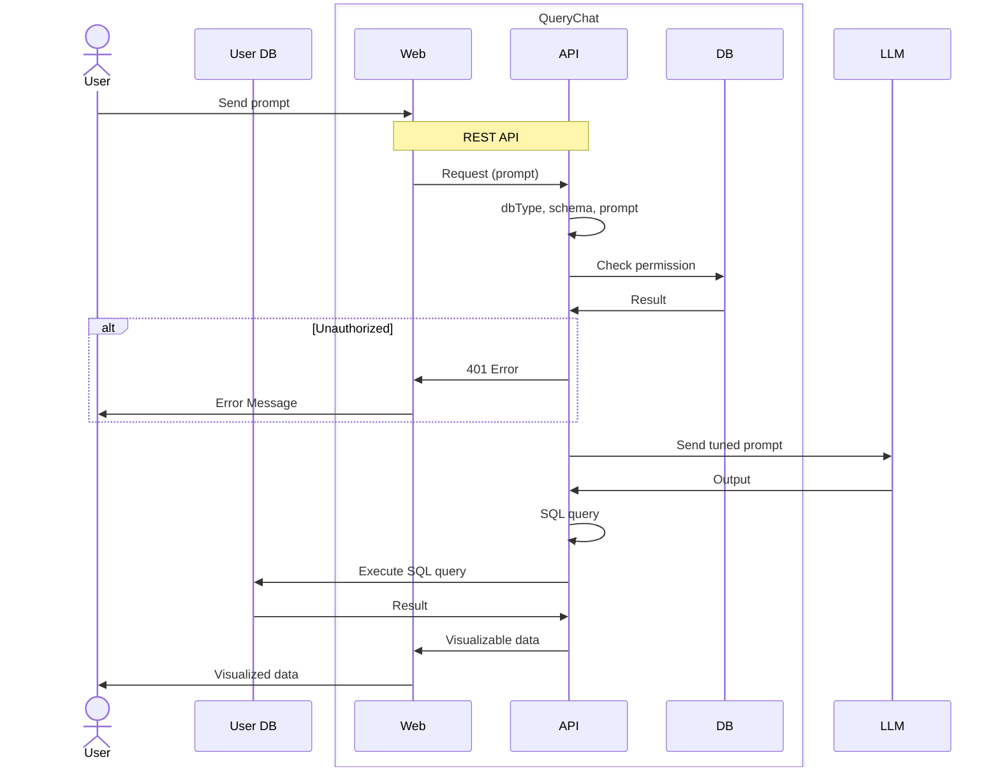

# Domain

## Sequence Diagram

```mermaid
sequenceDiagram
  actor User
  participant User DB
  box QueryChat
    participant Web
    participant API
    participant DB
  end
  participant LLM

  User ->> Web: Send prompt
  Note over Web, API: REST API
  Web ->> API: Request (prompt)
  API ->> API: dbType, schema, prompt
  API ->> DB: Check permission
  DB ->> API: Result
  alt Unauthorized
    API ->> Web: 401 Error
    Web ->> User: Error Message
  end
  API ->> LLM: Send tuned prompt
  LLM ->> API: Output
  API ->> API: SQL query
  API ->> User DB: Execute SQL query
  User DB ->> API: Result
  API ->> Web: Visualizable data
  Web ->> User: Visualized data
```
